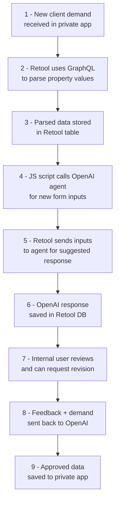

# retool-complex-demand-analyzer
This solution is composed of a Retool internal App that helps teams quickly understand complex client demands and speeds up response times— from an average 80 minutes per demand to 15 minutes.

## Address

This is a private project, but you can understand its operational impact by reviewing the OnFrontiers product [[`onfrontiers.com`](https://www.onfrontiers.com/product)] and a few code samples of the solution in the summary below:

## **Brief Context**

Expert networks depend on rapidly understanding client requests. To accelerate this process, I built a an app that integrates:

- Client-submitted forms hosted on a private app.
- Automated context summarization using OpenAI.
- A Retool frontend for quick internal review.

This solution is composed of a Retool internal App that helps teams quickly understand complex client demands and speeds up response times— from an average 80 minutes per demand to 15 minutes.

## **Acceptance Criteria**

1. Client forms must be accurately summarized by GPT 4o.
2. A simple and elegant Retool frontend that allows internal users to quickly read, understand, and utilize information to select the best experts.

## **Draft Solution**

1. When a new client demand is received in our private app, Retool uses GraphQL to parse the relevant property values.
2. The parsed data is stored in a Retool table, referencing our product objects through foreign keys.
3. A JavaScript function then calls an OpenAI agent, requesting inputs for a new internal-client demand form based on predefined models.
4. Retool sends these inputs to the agent, asking for a suggested response.
5. The OpenAI-generated response is stored in the Retool database.
6. An internal user reviews the response and can request a revised version by clicking a button in the Retool frontend.
7. The user may provide feedback or additional input in an open text field, which is sent along with the client demand details.
8. Once approved, the data inputs—updated with OpenAI’s feedback—are saved back to our private app.

## **Building Blocks**

### **Check all my projects**

